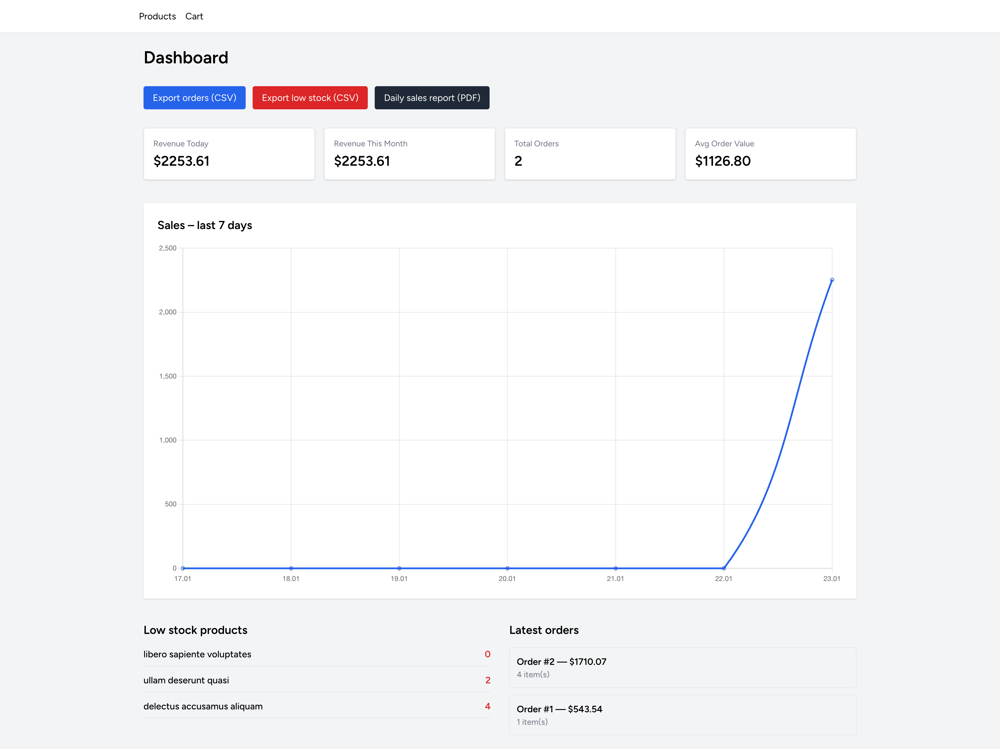
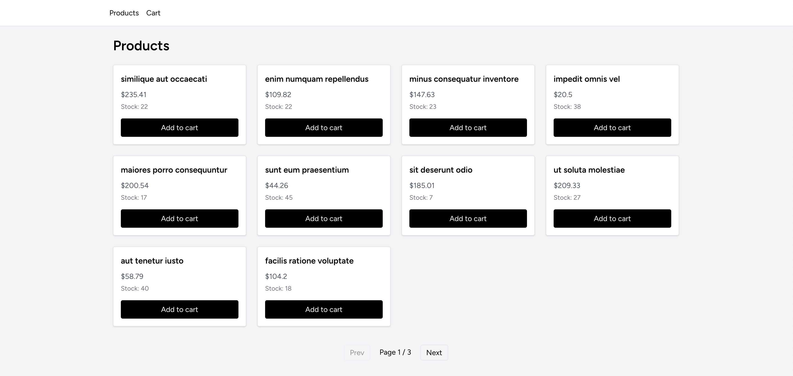
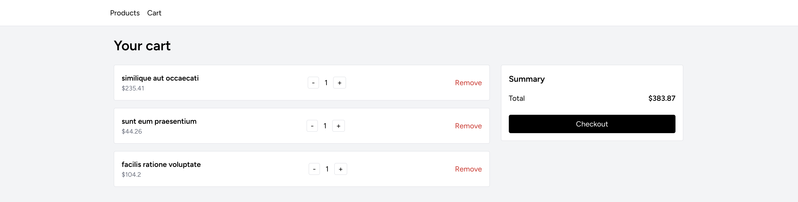

# 🛒 Laravel E-commerce Cart & Dashboard

Demo e-commerce application built with **Laravel 12**, **Inertia.js**, and **React**.  
The goal of this project is to demonstrate clean backend architecture, cart & checkout logic, background jobs, reports, and a rich admin dashboard.

This is **not a production system**, but a **showcase**.

---

## ✨ Features

### 🛍 Products & Cart
- Product listing with available stock
- Add / update / remove cart items
- Real-time stock validation
- Cart total price calculated via model accessor
- Clear error handling for insufficient stock

### 💳 Checkout
- Checkout wrapped in database transaction
- Row-level locking to prevent overselling
- Creates orders and order items
- Clears cart after successful checkout

### 📊 Dashboard
- Revenue today
- Revenue this month
- Total orders
- Average order value
- Latest orders list
- Low-stock product list
- Sales chart (last 7 days)

### 📦 Stock Monitoring
- Low stock detection
- Event → Job → Mail flow
- Admin notified when product stock is low

### 📄 Reports & Exports (available features)
- Orders CSV export
- Low-stock products CSV export
- Daily sales PDF report
- Daily sales email report (scheduler)

---

## 🖼 Screenshots

Dashboard  

Products  

Cart  

---

## 🧱 Tech Stack

- Backend: Laravel 12
- Frontend: React + Inertia.js
- Authentication: Laravel Sanctum (SPA)
- Database: SQLite / MySQL
- Queues: Laravel Jobs (database / sync)
- Mail: Laravel Mailables
- Charts: Chart.js
- Build tool: Vite

---

## 🏗 Architecture Notes

- Thin controllers
- Business logic extracted into services
- Database transactions for critical flows
- Events and queued jobs for async work
- Model accessors for computed values
- API Resources for consistent responses
- Feature & unit tests included

_No modular monolith or microservice architecture is used._

---

## 🚀 Installation

### Clone repository

git clone https://github.com/aleksdjukic/ecommerce-cart-laravel-react  
cd ecommerce-cart-laravel-react

### Install dependencies

composer install  
npm install

### Environment setup

cp .env.example .env  
php artisan key:generate

### Run migrations

php artisan migrate

### Build frontend assets

npm run build

### Start development server

php artisan serve

---

## 🔐 Authentication

Uses **Laravel Sanctum SPA authentication**.

- Session-based auth
- CSRF protected
- Axios configured with `withCredentials`

---

## 🧪 Tests

Run all tests:

php artisan test

Covered areas:
- Authentication flows
- Cart & checkout logic
- Stock validation
- Low-stock job dispatch
- Daily sales report mail

---

## ⏰ Scheduler

Daily sales report is sent automatically using Laravel Scheduler.

---

## 👤 Demo Credentials

Email: demo@example.com  
Password: password

---

## 📄 License

MIT License
